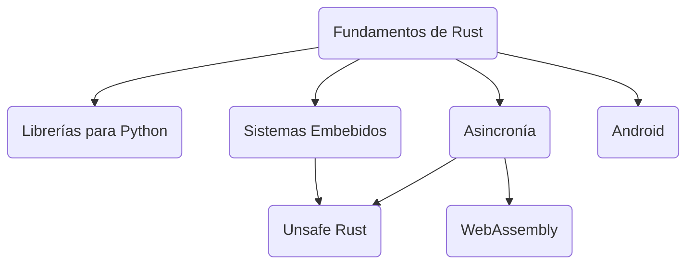

# NV/Rust

Bienvenido al curso de Rust desde 0. En este curso vamos a partir desde lo más básico y luego especializarnos en ciertas áreas más específicas para poder ver cómo podemos aprovechar las ventajas que posee Rust en ciertos entornos.

Es recomendable también ya saber programar en algún lenguaje de programación antes de tomar el curso, pues en el curso se asume que se sabe algún lenguaje de antemano. Lo ideal sería que tenga experiencia programando en C++ y Python (lenguajes que se harán referencias para ejemplificar a lo largo del curso), aunque otros lenguajes también están bien. No se recomienda para aprender a programar como primer lenguaje.

Lo recomendable, es iniciar con el primer bloque, y luego elegir el bloque que le interese más. De manera más específica, este es un esquema de "requisitos".



# [Bloque 1: Fundamentos de Rust](./Bloque%201%20-%20Fundamentos%20de%20Rust/)
>_(Rust Vanilla)_
>
> Basado en:
> [_The Rust Programming Language_](https://doc.rust-lang.org/book/title-page.html)

## [Introducción](./Bloque%201%20-%20Fundamentos%20de%20Rust/1.01%20-%20Introducción/Introducción.md)
1. Rust
2. Instalación
3. Compilador: `rustc` y `cargo`
4. IDEs
5. Hello World!

## [Conceptos básicos](./Bloque%201%20-%20Fundamentos%20de%20Rust/1.02%20-%20Conceptos%20Básicos/ConceptosBásicos.md)
1. Variables y mutabilidad
2. Tipos de datos
3. Operaciones
4. _Input_/_Output_
5. Importaciones
6. `const`

## [Control de flujo](./Bloque%201%20-%20Fundamentos%20de%20Rust/1.03%20-%20Control%20de%20Flujo/ControlDeFlujo.md)
1. Condicionales
2. Bucles

## [Funciones y bloques](./Bloque%201%20-%20Fundamentos%20de%20Rust/1.04%20-%20Funciones%20y%20Bloques/FuncionesYBloques.md)
1. Funciones
2. Parámetros y retorno
3. Bloques y alcance

## [_Ownership_](./Bloque%201%20-%20Fundamentos%20de%20Rust/1.05%20-%20Ownership/Ownership.md)
1. Reglas de propiedad
2. Cadenas de texto
3. Mover
4. Clonar y copiar
5. Funciones
6. Referencias y _borrowing_
7. El compilador

## [Datos compuestos](./Bloque%201%20-%20Fundamentos%20de%20Rust/1.06%20-%20Datos%20Compuestos/DatosCompuestos.md)
1. Cadenas de Texto
2. Arreglos
3. Tuplas
4. Vectores
5. Hash Maps
6. `slice`

## [Estructuras](./Bloque%201%20-%20Fundamentos%20de%20Rust/1.07%20-%20Estructuras/Estructuras.md)
1. Estructuras
2. Métodos

## [_Enums_](./Bloque%201%20-%20Fundamentos%20de%20Rust/1.08%20-%20Enums/Enums.md)
1. _Enums_
2. Match
3. `if let`

## [Paquetes y manejo de errores](./Bloque%201%20-%20Fundamentos%20de%20Rust/1.09%20-%20Paquetes%20y%20Manjeo%20de%20Errores/PaquetesYManejoDeErrores.md)
1. Paquetes, crates y módulos
2. Manejo de errores

## [Datos genéricos, _traits_ y _lifetime_](./Bloque%201%20-%20Fundamentos%20de%20Rust/1.10%20-%20Datos%20Genéricos,%20Taits%20y%20Lifetime/DatosGenéricosTraitsYLifetime.md)
1. Tipos de datos genéricos
2. _Traits_
3. _Lifetime_

## [Pruebas](./Bloque%201%20-%20Fundamentos%20de%20Rust/1.11%20-%20Pruebas/Pruebas.md)
1. Pruebas (_tests_)

## [Paradigmas de programación](./Bloque%201%20-%20Fundamentos%20de%20Rust/1.12%20-%20Paradigmas%20de%20Programación/PradigmasDeProgramación.md)
1. Programación Funcional
2. Programación Orientada a Objetos

## [Punteros Inteligentes](./Bloque%201%20-%20Fundamentos%20de%20Rust/1.13%20-%20Punteros%20Inteligentes/PunterosInteligentes.md)
1. Punteros Inteligentes
2. `Box<T>`
3. `Deref`
4. `Drop`
5. `Rc<T>`
6. `RefCell<T>`
7. `Weak<T>`

## [Concurrencia](./Bloque%201%20-%20Fundamentos%20de%20Rust/1.14%20-%20Concurrencia/Concurrencia.md)
1. _Fearless Concurrency_
2. Hilos
3. Transferencia de información
4. Exclusión mutua
5. Extendiendo concurrencia
6. Asincronía

## [Patterns](./Bloque%201%20-%20Fundamentos%20de%20Rust/1.15%20-%20Patterns/Patterns.md)
1. Patters
2. Patterns con `match`
3. Patterns con `if`
4. Patterns con variables
5. Patterns con `while`
6. Desestructuración

## [Conceptos avanzados](./Bloque%201%20-%20Fundamentos%20de%20Rust/1.16%20-%20Conceptos%20Avanzados/ConceptosAvanzados.md)
1. _Unsafe_
2. Macros

## Proyecto
> _(Aplicación de línea de comandos en Rust)_
>
> Basado en:
> [_Command Line Applications in Rust_](https://rust-cli.github.io/book/index.html)

# Bloques en progreso
```markdown
# Bloque 2: Librerías para Python  
> _(Desarrollo de librerías para Python desde Rust con PyO3)_

> Basado en:
> [_PyO3 user guide_](https://pyo3.rs/v0.26.0/index.html)

# Bloque 3: Sistemas Embebidos y Críticos  
> _(Enfocado en bajo nivel, control de hardware, entornos sin sistema operativo, y aplicaciones de tiempo real.)_

> Basado en:
> [_The Embedded Rust Book_](https://docs.rust-embedded.org/book/)

# Bloque 4: Asincronía
> _(Enfocado en programación asincrónica en Rust)_

> Basado en:
> [_Asynchronous Programming in Rust_](https://rust-lang.github.io/async-book/)

# Bloque 5: WebAssembly, Servidores y Backend  
> _(Enfocado en aplicaciones web y servicios escalables)_

> Basado en:
> [_Rust and WebAssembly_](https://rustwasm.github.io/docs/book/)

# Bloque 6: Android  
> _(Enfoque corto para software del sistema en Android)_

> Basado en:
> [_Comprehensive Rust_](https://google.github.io/comprehensive-rust/index.html)

# Bloque 7: Unsafe Rust
> _(Enfocado en las oscuras artes del unsafe rust)_

> Basado en:
> [The Rustonomicon](https://doc.rust-lang.org/nomicon/)

```